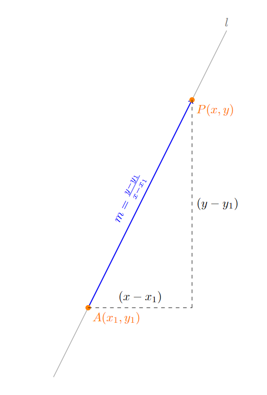

<!-- code -->
<link rel="stylesheet" href="/assets/three/style.css">

## 직선의 방정식 : $x-y$의 관계식

{: width="972" height="589" .w-50 .left} 한 점 $A(x_1, y_1)$을 지나고 기울기가 m인 직선 $l$ 을 다음과 같이 표현할 수 있다.

한 점 A를 지나고 기울기가 m인 직선 l은 다음과 같이 표현할 수 있다.

$$
y = mx + n
$$

> 두 점 $ A=(x_1, y_1) $, $ B = (x_2, y_2) $ 를 지나는 직선의 방정식

<!-- Spinning Cube Demo -->

    

<!-- Including the JavaScript module -->

기울기가 $m$이고 $y$절편이 $n$ 인 직선의 방정식
$$
y = mx + n
$$

기울기 m 구하기

$$
m = {y_2 - y_1 \over x_2 - x_1}
$$

두 점을 이용해 직선의 방정식 구하기
$$
y = {y_2 - y_1 \over x_2 - x_1}{(x - x_1)} + y_1
$$

#### 기울기 

좌표 평면에서 기울기가 $ m $ $ A(x_1, y_1) $ 점을 지나는 직선

## 외적의 정의

$$
\mathbf{a} \times \mathbf{b} = \begin{vmatrix}
\mathbf{i} & \mathbf{j} & \mathbf{k} \\
a_1 & a_2 & a_3 \\
b_1 & b_2 & b_3 \\
\end{vmatrix}
$$

$ \vec r = \begin{bmatrix}3 \\ 2 \end{bmatrix} $

$$ 
\mathbf{a} \times \mathbf{b} = (a_2b_3 - a_3b_2)\mathbf{i} - (a_1b_3 - a_3b_1)\mathbf{j} + (a_1b_2 - a_2b_1)\mathbf{k} 
$$

## Reference
 R Markdown (https://www.statpower.net/Content/310/R%20Stuff/SampleMarkdown.html)

