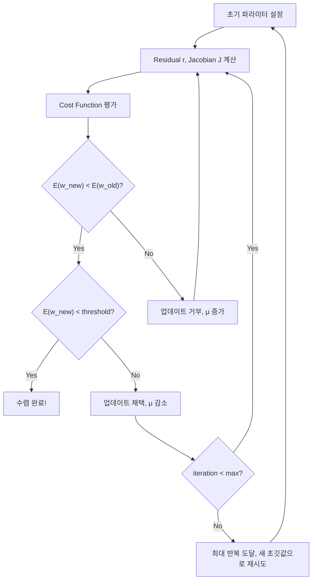

# 최적화(Optimization) 이론 기초

---

참조 : [gaussian37 - 최적화 이론 기초 정리](https://gaussian37.github.io/math-calculus-basic_optimization/)

참조 : [ALIDA - 에러와 자코비안 정리 (Errors and Jacobians)](https://alida.tistory.com/65)

이 글에서는 최적화(Optimization)의 핵심 알고리즘들을 **직관적으로** 이해할 수 있도록 정리합니다. 수식만 나열하는 게 아니라, **"왜 이런 수식이 나오는지"** 를 하나하나 풀어서 설명합니다.

다루는 내용:

- Gradient Descent (경사 하강법)
- Newton Method (뉴턴 방법)
- Gauss-Newton Method (가우스-뉴턴 방법)
- Levenberg-Marquardt Method (르벤버그-마쿼트 방법)
- Quasi Newton Method / Lagrange Multiplier
- 딥러닝 옵티마이저: SGD, Momentum, RMSProp, Adam

---

## 최적화란 무엇인가?

한 문장으로: **어떤 함수의 값을 최소(또는 최대)로 만드는 입력값을 찾는 것.**

$$
\min_{\mathbf{x}} f(\mathbf{x})
$$

여기서 $f$ 는 **목적함수(objective function)**, $\mathbf{x}$ 는 우리가 조절할 수 있는 **파라미터**입니다.

예를 들어 머신러닝에서는 "손실 함수(Loss function)"가 $f$ 이고, 모델의 가중치(weight)가 $\mathbf{x}$ 입니다. 이 손실을 가장 작게 만드는 가중치를 찾는 게 학습(training)이고, 그 과정이 바로 최적화입니다.

---

## Gradient Descent (경사 하강법)

### 직관 — 눈 감고 산에서 내려오기

산꼭대기에 눈을 감고 서 있다고 상상해보세요. 가장 낮은 곳(골짜기)으로 내려가고 싶은데, 눈을 감았으니 발밑을 더듬어서 **"지금 어느 방향이 가장 가파르게 내려가는지"** 를 느끼고, 그 방향으로 한 발짝 내딛습니다. 이걸 반복하면 결국 골짜기에 도달합니다.

### 수식

$$
\mathbf{x}_{k+1} = \mathbf{x}_k - \alpha \nabla f(\mathbf{x}_k)
$$

각 기호를 하나씩 분해하면:

- $\mathbf{x}_k$ : 현재 위치 (k번째 스텝)
- $\nabla f(\mathbf{x}_k)$ : 현재 위치에서의 **Gradient(기울기)** — 함수값이 가장 빠르게 **증가하는** 방향
- $-\nabla f$ : Gradient의 **반대 방향** — 함수값이 가장 빠르게 **감소하는** 방향
- $\alpha$ : **학습률(learning rate)** — 한 발짝의 크기
- $\mathbf{x}_{k+1}$ : 다음 위치

왜 마이너스가 붙냐? Gradient는 함수값이 **증가하는** 방향을 가리키니까, 최솟값을 찾으려면 **반대** 방향으로 가야 합니다.

### 학습률(α)이 왜 중요한가?

아래 3D 시각화에서 직접 확인해보세요. 공이 3D 표면 위에서 Gradient Descent로 최솟값을 찾아가는 과정입니다.

<!-- Three.js Gradient Descent Visualization -->
<link rel="stylesheet" href="/assets/three/style.css">

    

- **α가 너무 크면**: 골짜기를 건너뛰어서 발산 (공이 골짜기 양쪽을 왔다갔다)
- **α가 너무 작으면**: 수렴은 하지만 너무 느림
- **적절한 α**: 빠르고 안정적으로 수렴

### 1변수 예시로 확인

$f(x) = x^2$ 을 최소화한다면:

$$
f'(x) = 2x
$$

$$
x_{k+1} = x_k - \alpha \cdot 2x_k = x_k(1 - 2\alpha)
$$

$x_0 = 5$, $\alpha = 0.1$ 이면:

$$
x_1 = 5 - 0.1 \times 10 = 4
$$

$$
x_2 = 4 - 0.1 \times 8 = 3.2
$$

$$
x_3 = 3.2 - 0.1 \times 6.4 = 2.56
$$

$$
\vdots
$$

점점 0에 가까워지죠? $f(x) = x^2$ 의 최솟값은 $x=0$ 에서 $0$ 이니까, 올바른 방향으로 수렴하고 있습니다.

### 다변수 확장

변수가 여러 개인 경우, Gradient는 **벡터**가 됩니다.

$$
\nabla f = \begin{bmatrix} \frac{\partial f}{\partial x_1} \\ \frac{\partial f}{\partial x_2} \\ \vdots \\ \frac{\partial f}{\partial x_n} \end{bmatrix}
$$

각 편미분은 "해당 변수 방향으로 함수가 얼마나 변하는지"를 나타냅니다.

---

## Newton Method (뉴턴 방법)

### Gradient Descent와 뭐가 다른가?

Gradient Descent는 **1차 미분(기울기)** 만 봅니다.  "어느 방향이 내리막인가?" 만 알 수 있죠.

Newton Method는 **2차 미분(곡률, Hessian)** 까지 봅니다. "어느 방향이 내리막이고, 그 내리막이 얼마나 빨리 평탄해지는가?" 까지 알 수 있으므로, **최저점이 대략 어디쯤인지** 한 번에 추정합니다.

### 수식 유도 — 테일러 전개 기반

함수 $f(x)$ 를 현재 위치 $x_k$ 근처에서 **2차 테일러 전개** 하면:

$$
f(x) \approx f(x_k) + f'(x_k)(x - x_k) + \frac{1}{2}f''(x_k)(x - x_k)^2
$$

이 근사 함수(2차 다항식)의 최솟값을 찾으려면, $x$ 에 대해 미분해서 0으로 놓으면 됩니다:

$$
\frac{d}{dx}\left[f(x_k) + f'(x_k)(x - x_k) + \frac{1}{2}f''(x_k)(x - x_k)^2\right] = 0
$$

$$
f'(x_k) + f''(x_k)(x - x_k) = 0
$$

$$
x - x_k = -\frac{f'(x_k)}{f''(x_k)}
$$

따라서 **업데이트 공식**:

$$
\boxed{x_{k+1} = x_k - \frac{f'(x_k)}{f''(x_k)}}
$$

### 다변수에서의 Newton Method

변수가 여러 개이면, $f'$ 는 **Gradient 벡터** $\nabla f$, $f''$ 는 **Hessian 행렬** $\mathbf{H}$ 가 됩니다:

$$
\mathbf{H} = \begin{bmatrix}
\frac{\partial^2 f}{\partial x_1^2} & \frac{\partial^2 f}{\partial x_1 \partial x_2} & \cdots \\
\frac{\partial^2 f}{\partial x_2 \partial x_1} & \frac{\partial^2 f}{\partial x_2^2} & \cdots \\
\vdots & \vdots & \ddots
\end{bmatrix}
$$

업데이트 공식:

$$
\mathbf{x}_{k+1} = \mathbf{x}_k - \mathbf{H}^{-1} \nabla f(\mathbf{x}_k)
$$

Gradient Descent의 $\alpha$ (학습률)가 Newton에서는 $\mathbf{H}^{-1}$ (Hessian의 역행렬)로 대체된 겁니다. 즉, **자동으로 최적의 스텝 크기를 계산**해주는 셈입니다.

### 비교 정리

| | Gradient Descent | Newton Method |
|---|---|---|
| 사용 정보 | 1차 미분 (Gradient) | 1차 + 2차 미분 (Gradient + Hessian) |
| 수렴 속도 | 선형 수렴 (느림) | 이차 수렴 (매우 빠름) |
| 스텝당 계산량 | 적음 | Hessian 역행렬 → 많음 |
| 적합한 상황 | 파라미터 많을 때 (딥러닝) | 파라미터 적을 때 |

---

## SLAM에서의 최적화 — 에러와 자코비안

> 이 섹션은 [ALIDA 블로그](https://alida.tistory.com/65) 내용을 참고하여 SLAM 관점에서 최적화를 정리합니다.

### 에러(Error)의 정의

SLAM에서 에러란 센서 데이터에 의한 **관측값(measurement)** $z$ 과 수학적 모델에 의한 **예측값(estimate)** $\hat{z}$ 의 차이입니다:

$$
e(\mathbf{x}) = z - \hat{z}(\mathbf{x})
$$

$\mathbf{x}$ 는 모델의 상태 변수(로봇 포즈, 3D 점 좌표 등)이고, 이 에러를 최소로 만드는 최적의 $\mathbf{x}^*$ 를 찾는 것이 SLAM의 최적화 문제입니다.

SLAM에서 흔히 사용하는 에러 종류:

- **Reprojection error**: $e = p - \hat{p} \in \mathbb{R}^2$ (특징점 기반 Visual SLAM)
- **Photometric error**: $e = I_1(p_1) - I_2(p_2) \in \mathbb{R}^1$ (Direct 방식 Visual SLAM)
- **Relative pose error**: $e_{ij} = \text{Log}(z_{ij}^{-1}\hat{z}_{ij}) \in \mathbb{R}^6$ (Pose Graph Optimization)

### MLE 기반 에러 함수 유도

에러가 **정규분포**를 따른다고 가정합니다:

$$
e(\mathbf{x}) = z - \hat{z}(\mathbf{x}) \sim \mathcal{N}(0, \Sigma)
$$

에러의 확률은 다변수 정규분포로 표현됩니다:

$$
p(e) \propto \exp\left(-\frac{1}{2}(z - \hat{z})^T \Sigma^{-1} (z - \hat{z})\right)
$$

여기서 $\Omega = \Sigma^{-1}$ 는 **Information matrix** (공분산의 역행렬)입니다.

log-likelihood를 적용하면:

$$
\ln p(e) \propto -\frac{1}{2} e(\mathbf{x})^T \Omega \, e(\mathbf{x})
$$

이 log-likelihood를 최대화(= negative log-likelihood를 최소화)하는 $\mathbf{x}^*$ 를 찾으면 됩니다. 이것이 **Maximum Likelihood Estimation (MLE)** 입니다:

$$
\mathbf{x}^* = \arg\min_\mathbf{x} \, e(\mathbf{x})^T \Omega \, e(\mathbf{x})
$$

모든 에러를 합하면 **에러 함수 $E$** 가 됩니다:

$$
E(\mathbf{x}) = \sum_i e_i(\mathbf{x})^T \Omega_i \, e_i(\mathbf{x})
$$

### Gauss-Newton 풀이 — 단계별 유도

에러 함수 $E$ 를 최소화하는 과정을 단계별로 따라가봅시다:

**1단계: 에러 함수에 증분량 $\Delta\mathbf{x}$ 를 적용**

$$
E(\mathbf{x} + \Delta\mathbf{x}) = \sum_i e_i(\mathbf{x} + \Delta\mathbf{x})^T \Omega_i \, e_i(\mathbf{x} + \Delta\mathbf{x})
$$

**2단계: 테일러 1차 근사 적용**

$$
e(\mathbf{x} + \Delta\mathbf{x}) \approx e(\mathbf{x}) + J \Delta\mathbf{x}
$$

여기서 $J = \frac{\partial e(\mathbf{x}+\Delta\mathbf{x})}{\partial \mathbf{x}}$ 는 **자코비안 행렬**입니다.

**3단계: 전개 후 정리**

에러 함수에 대입하면:

$$
E(\mathbf{x} + \Delta\mathbf{x}) \approx (e + J\Delta\mathbf{x})^T \Omega (e + J\Delta\mathbf{x})
$$

$$
= \underbrace{e^T\Omega e}_{c} + \underbrace{2e^T\Omega J}_{b}\Delta\mathbf{x} + \Delta\mathbf{x}^T \underbrace{J^T\Omega J}_{H}\Delta\mathbf{x}
$$

$$
= c + 2b\Delta\mathbf{x} + \Delta\mathbf{x}^T H \Delta\mathbf{x}
$$

**4단계: $\Delta\mathbf{x}$ 에 대해 미분 → 0 설정**

$$
\frac{\partial E}{\partial \Delta\mathbf{x}} = 2b + 2H\Delta\mathbf{x} = 0
$$

$$
\boxed{H\Delta\mathbf{x} = -b}
$$

이것이 **Normal Equation**이며, 여기서:
- $H = J^T\Omega J$ (Hessian 근사)
- $b = e^T\Omega J$ (Gradient)

**5단계: 업데이트**

$$
\mathbf{x} \leftarrow \mathbf{x} + \Delta\mathbf{x}
$$

이 과정을 수렴할 때까지 반복하는 것이 **Gauss-Newton 방법**입니다.

### LM으로 확장

LM은 GN의 Normal Equation에 damping factor $\lambda$ 만 추가합니다:

$$
\text{(GN)} \quad H\Delta\mathbf{x} = -b
$$

$$
\text{(LM)} \quad (H + \lambda I)\Delta\mathbf{x} = -b
$$

$\lambda$ 가 크면 Gradient Descent처럼 보수적으로, 작으면 Gauss-Newton처럼 공격적으로 동작합니다. 앞서 설명한 것과 정확히 같은 원리입니다.

### 자코비안(Jacobian) — 왜 중요한가?

위 풀이에서 핵심은 **자코비안 $J$ 를 어떻게 구하느냐**입니다. 에러 유형에 따라 자코비안이 달라집니다:

- **Reprojection error**: $J = \frac{\partial e}{\partial [\mathbf{w}, \mathbf{t}]}$ — 카메라 포즈에 대한 미분
- **Photometric error**: $J = \frac{\partial e}{\partial \xi}$ — twist에 대한 미분
- **Relative pose error**: $J = \frac{\partial e_{ij}}{\partial [\xi_i, \xi_j]}$ — 두 노드의 포즈에 대한 미분

각 자코비안은 **Chain rule**로 분해하여 계산합니다. 예를 들어 Reprojection error의 포즈 자코비안:

$$
J_c = \frac{\partial \hat{p}}{\partial \tilde{p}} \cdot \frac{\partial \tilde{p}}{\partial X'} \cdot \frac{\partial X'}{\partial [\Delta\mathbf{w}, \mathbf{t}]}
$$

$$
= \mathbb{R}^{2 \times 3} \cdot \mathbb{R}^{3 \times 4} \cdot \mathbb{R}^{4 \times 6} = \mathbb{R}^{2 \times 6}
$$

이때 회전행렬 $R \in SO(3)$ 은 **Lie algebra** $\mathfrak{so}(3)$ 의 각속도 $\mathbf{w}$ 로 변환하여 미분합니다. 이는 회전행렬이 9개 파라미터로 over-parameterized 되어 있기 때문에, 최소 3자유도 표현인 Lie algebra를 사용하는 것이 수치적으로 안정적이기 때문입니다.

---

## 비선형 최소제곱(Non-Linear Least Squares)

### 왜 중요한가?

실제 최적화 문제의 대부분은 이런 형태입니다:

> "관측 데이터와 모델 예측의 차이(잔차, Residual)를 최소화하라"

$$
\min_{\mathbf{w}} f(\mathbf{w}) = \min_{\mathbf{w}} \frac{1}{2}\sum_{i=1}^{m} r_i(\mathbf{w})^2 = \min_{\mathbf{w}} \frac{1}{2} \mathbf{r}^T \mathbf{r}
$$

여기서:
- $\mathbf{w}$ : 추정할 파라미터 (예: 곡선 피팅의 계수)
- $r_i(\mathbf{w}) = y_i - \hat{y}_i$ : **잔차(Residual)** — 실제값과 예측값의 차이
- $\mathbf{r}$ : 잔차 벡터

### Gradient Descent 적용

이 목적함수에 Gradient Descent를 적용하면:

$$
w_{\text{new}} = w_{\text{old}} - \lambda J_r^T \mathbf{r}
$$

여기서 $J_r$ 은 잔차 함수의 **Jacobian 행렬** (각 잔차를 각 파라미터로 편미분한 행렬)입니다.

$$
J_r = \begin{bmatrix}
\frac{\partial r_1}{\partial w_1} & \frac{\partial r_1}{\partial w_2} & \cdots \\
\frac{\partial r_2}{\partial w_1} & \frac{\partial r_2}{\partial w_2} & \cdots \\
\vdots & \vdots & \ddots
\end{bmatrix}
$$

---

## Gauss-Newton Method (가우스-뉴턴 방법)

### 핵심 아이디어

Newton Method를 쓰고 싶은데, Hessian(2차 미분)을 구하기가 너무 어렵습니다. 그래서 **"Hessian을 1차 미분(Jacobian)만으로 근사하자!"** 가 Gauss-Newton의 핵심입니다.

### 수식 유도

최소제곱 목적함수 $f(\mathbf{w}) = \frac{1}{2}\mathbf{r}^T\mathbf{r}$ 의 Gradient와 Hessian을 구하면:

**Gradient:**

$$
\nabla f = J_r^T \mathbf{r}
$$

**Hessian:**

$$
\mathbf{H} = J_r^T J_r + \sum_{i=1}^{m} r_i \nabla^2 r_i
$$

Hessian의 두 번째 항 $\sum r_i \nabla^2 r_i$ 는 잔차 $r_i$ 에 비례합니다. 최적해 근처에서는 잔차가 충분히 작아지므로:

$$
\mathbf{H} \approx J_r^T J_r
$$

이걸 Newton 업데이트 공식 $\mathbf{x}_{k+1} = \mathbf{x}_k - \mathbf{H}^{-1}\nabla f$ 에 넣으면:

$$
\boxed{w_{\text{new}} = w_{\text{old}} - (J_r^T J_r)^{-1} J_r^T \mathbf{r}}
$$

**2차 미분 없이, 1차 미분(Jacobian)만으로 Newton과 비슷한 수렴 성능**을 냅니다!

### 한계

- $J_r^T J_r$ 가 **특이행렬(singular)** 에 가까우면 역행렬이 불안정
- 잔차가 크면 Hessian 근사가 부정확해져 수렴 실패 가능

---

## Levenberg-Marquardt Method (르벤버그-마쿼트 방법)

### 왜 필요한가?

Gauss-Newton의 문제를 해결하기 위해 **감쇠 항(damping term)** 을 추가합니다.

$$
\boxed{w_{\text{new}} = w_{\text{old}} - (J_r^T J_r + \mu \mathbf{I})^{-1} J_r^T \mathbf{r}}
$$

Gauss-Newton 공식과 비교하면, $\mu \mathbf{I}$ (감쇠 항)만 추가된 것입니다.

### μ(뮤)의 역할 — Gradient Descent와 Gauss-Newton 사이의 스위치

이 부분이 Levenberg-Marquardt의 가장 아름다운 점입니다:

**μ가 큰 경우** ($\mu \gg 0$):

$$
J_r^T J_r + \mu \mathbf{I} \approx \mu \mathbf{I}
$$

$$
\Rightarrow w_{\text{new}} \approx w_{\text{old}} - \frac{1}{\mu} J_r^T \mathbf{r}
$$

이건 **Gradient Descent**와 같은 형태! 보수적이고 안정적이지만 느립니다.

**μ가 작은 경우** ($\mu \to 0$):

$$
J_r^T J_r + \mu \mathbf{I} \approx J_r^T J_r
$$

이건 **Gauss-Newton**과 같은 형태! 공격적이고 빠르지만 불안정할 수 있습니다.

즉, **$\mu$ 하나로 두 방법 사이를 부드럽게 전환**합니다:

- 최적화가 잘 되고 있으면 → $\mu$ 를 **줄여서** Gauss-Newton에 가깝게 (속도 ↑)
- 최적화가 불안정하면 → $\mu$ 를 **키워서** Gradient Descent에 가깝게 (안정성 ↑)

### 시각화 — Gauss-Newton vs Levenberg-Marquardt 수렴 비교

    

### LM 알고리즘 흐름도

---

## Quasi-Newton Method (준 뉴턴 방법)

Newton Method의 또 다른 우회법입니다. Hessian을 정확히 구하지 않고, **매 반복마다 Gradient 변화량을 이용해 Hessian 근사치를 점진적으로 갱신**합니다.

대표 알고리즘: **BFGS** (Broyden-Fletcher-Goldfarb-Shanno)

$$
\mathbf{x}_{k+1} = \mathbf{x}_k - \mathbf{B}_k^{-1} \nabla f(\mathbf{x}_k)
$$

여기서 $\mathbf{B}_k$ 는 Hessian의 근사 행렬이며, 매 스텝마다 다음과 같이 갱신됩니다:

$$
\mathbf{B}_{k+1} = \mathbf{B}_k + \frac{\Delta g \cdot \Delta g^T}{\Delta g^T \cdot \Delta x} - \frac{\mathbf{B}_k \Delta x \cdot (\mathbf{B}_k \Delta x)^T}{\Delta x^T \mathbf{B}_k \Delta x}
$$

- $\Delta x = \mathbf{x}_{k+1} - \mathbf{x}_k$ : 위치 변화량
- $\Delta g = \nabla f_{k+1} - \nabla f_k$ : Gradient 변화량

메모리가 부족할 때는 **L-BFGS** (Limited-memory BFGS)를 사용합니다. 최근 $m$ 개의 $(\Delta x, \Delta g)$ 쌍만 저장하여 근사합니다.

---

## Lagrange Multiplier (라그랑주 승수법)

### 제약 조건이 있는 최적화

지금까지는 "아무 제약 없이 $f(\mathbf{x})$ 를 최소화" 하는 문제였습니다.

그런데 현실에서는 **제약 조건**이 있는 경우가 많습니다:

> "$g(\mathbf{x}) = 0$ 이라는 조건 하에서 $f(\mathbf{x})$ 를 최소화하라"

### 직관적 이해

등고선 지도를 생각해보세요. $f(\mathbf{x})$ 의 등고선(같은 함수값을 가진 곡선)과 제약 조건 $g(\mathbf{x}) = 0$ 의 곡선이 있습니다.

**핵심 관찰**: 제약 곡선 위의 최적점에서는, $f$ 의 등고선과 $g$ 의 곡선이 **접합니다**. 즉 두 함수의 Gradient가 **평행**합니다:

$$
\nabla f = \lambda \nabla g
$$

이를 **라그랑지안 함수**로 통합하면:

$$
\mathcal{L}(\mathbf{x}, \lambda) = f(\mathbf{x}) - \lambda \cdot g(\mathbf{x})
$$

$$
\frac{\partial \mathcal{L}}{\partial \mathbf{x}} = 0 \quad \text{(최적 조건)}
$$

$$
\frac{\partial \mathcal{L}}{\partial \lambda} = 0 \quad \text{(제약 조건 충족)}
$$

이 연립방정식을 풀면 제약 조건 하의 최적해를 구할 수 있습니다.

---

## 딥러닝에서의 Gradient Descent 변형

딥러닝에서 Newton 계열 대신 Gradient Descent 변형을 쓰는 이유:

1. 파라미터가 수백만 ~ 수억 개 → Hessian 행렬은 $n \times n$ 크기라 **계산/저장 불가**
2. 데이터가 수백만 개 → 전체 데이터에 대한 Gradient 계산도 비싸다

### SGD (Stochastic Gradient Descent)

데이터 **1개**씩 랜덤으로 뽑아서 Gradient를 추정합니다.

$$
\mathbf{w}_{k+1} = \mathbf{w}_k - \alpha \nabla f_i(\mathbf{w}_k)
$$

- **장점**: 매우 빠른 업데이트, 로컬 미니마 탈출에 유리
- **단점**: 노이즈가 크서 진동이 심함

### Mini-Batch Gradient Descent

데이터를 **작은 묶음(batch)** 으로 나눠서 Gradient 계산. SGD와 전체 배치의 절충안.

$$
\mathbf{w}_{k+1} = \mathbf{w}_k - \alpha \cdot \frac{1}{B}\sum_{i \in \text{batch}} \nabla f_i(\mathbf{w}_k)
$$

실무에서 **가장 많이 사용**하며, 일반적으로 "SGD"라 하면 사실 Mini-Batch를 의미합니다.

### Momentum (모멘텀)

**"관성"** 을 추가합니다. 이전 스텝의 이동 방향을 기억해서, 같은 방향으로 계속 가면 가속됩니다.

$$
\mathbf{v}_{k+1} = \beta \mathbf{v}_k + \nabla f(\mathbf{w}_k)
$$

$$
\mathbf{w}_{k+1} = \mathbf{w}_k - \alpha \mathbf{v}_{k+1}
$$

공이 언덕을 굴러 내려가면서 속도가 붙는 것과 같습니다. $\beta$ 는 보통 0.9로 설정합니다.

- 같은 방향 → 가속 (빠른 수렴)
- 방향이 바뀜 → 감속 (진동 억제)

### RMSProp

각 파라미터마다 **학습률을 다르게** 조절합니다. Gradient가 큰 방향은 학습률을 줄이고, 작은 방향은 키웁니다.

$$
s_k = \beta \cdot s_{k-1} + (1-\beta)(\nabla f)^2
$$

$$
\mathbf{w}_{k+1} = \mathbf{w}_k - \frac{\alpha}{\sqrt{s_k + \epsilon}} \nabla f
$$

$(\nabla f)^2$ 의 **지수이동평균**으로 스케일링하여, 모든 방향에서 균일한 진행을 만듭니다.

### Adam (Adaptive Moment Estimation)

**Momentum + RMSProp** 을 합친 것. 현재 딥러닝에서 **가장 많이 쓰는** 옵티마이저입니다.

$$
m_k = \beta_1 m_{k-1} + (1-\beta_1)\nabla f \quad \text{(1차 모멘트 = Momentum)}
$$

$$
v_k = \beta_2 v_{k-1} + (1-\beta_2)(\nabla f)^2 \quad \text{(2차 모멘트 = RMSProp)}
$$

초반에 $m_k, v_k$ 가 0으로 편향되는 문제를 **편향 보정(bias correction)** 으로 해결:

$$
\hat{m}_k = \frac{m_k}{1-\beta_1^k}, \quad \hat{v}_k = \frac{v_k}{1-\beta_2^k}
$$

$$
\boxed{\mathbf{w}_{k+1} = \mathbf{w}_k - \frac{\alpha}{\sqrt{\hat{v}_k} + \epsilon}\hat{m}_k}
$$

기본 하이퍼파라미터: $\beta_1 = 0.9$, $\beta_2 = 0.999$, $\epsilon = 10^{-8}$

---

## 전체 알고리즘 비교

| 방법 | 사용 정보 | 수렴 속도 | 주 사용처 |
|------|-----------|----------|-----------|
| Gradient Descent | 1차 미분 | 선형 수렴 | 딥러닝 (대규모) |
| Newton | 1차+2차 미분 | 이차 수렴 | 소규모 최적화 |
| Gauss-Newton | Jacobian | Newton급 | 비선형 최소제곱 |
| Levenberg-Marquardt | Jacobian + 댐핑 | 안정적 Newton급 | 커브피팅, SLAM |
| Quasi-Newton (BFGS) | Hessian 근사 | 초선형 수렴 | 중규모 최적화 |
| Adam | 1차 미분 + 적응적 | 실용적 빠름 | 딥러닝 (기본값) |

---

## 핵심 요약

1. **Gradient Descent**: 1차 미분만 사용, 간단하지만 느릴 수 있음
2. **Newton**: 2차 미분 추가로 빠르지만, Hessian 계산 비용이 큼
3. **Gauss-Newton**: Hessian을 Jacobian으로 근사 → Newton 속도, 1차 미분 비용
4. **Levenberg-Marquardt**: Gauss-Newton + 댐핑 → **안정성까지 확보**
5. **Adam**: Momentum + RMSProp → 딥러닝의 사실상 표준

최적화 방법 선택 기준:
- **데이터가 크고 파라미터가 많으면** → Adam, SGD + Momentum
- **데이터가 작고 정밀한 피팅이 필요하면** → Levenberg-Marquardt, Gauss-Newton
- **제약 조건이 있으면** → Lagrange Multiplier
