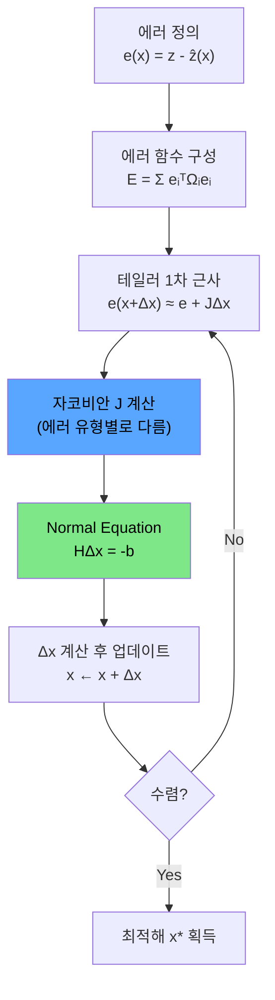

# 에러와 자코비안 정리 (Errors and Jacobians)

---

참조 : [ALIDA - 에러와 자코비안 정리 Part 1](https://alida.tistory.com/65)

참조 : [gaussian37 - 최적화 이론 기초 정리](https://gaussian37.github.io/math-calculus-basic_optimization/)

참조 : [공부하는박사곰 - 우도 함수(likelihood function)의 이해](https://studyingrabbit.tistory.com/66)

이 글에서는 SLAM에서 사용하는 최적화의 핵심인 **에러(Error)** 정의와 **자코비안(Jacobian)** 유도를 정리합니다. 이론만 나열하지 않고, **실제 데이터로 MLE → Gauss-Newton 풀이 과정을 한 스텝씩** 따라가며 숫자로 확인합니다.

---

## 1. 에러(Error)의 정의

SLAM에서 에러란 **센서 관측값**과 **모델 예측값**의 차이입니다.

$$
e(\mathbf{x}) = z - \hat{z}(\mathbf{x})
$$

- $z$ : **관측값(measurement)** — 센서 데이터로 실제 측정한 값
- $\hat{z}(\mathbf{x})$ : **예측값(estimate)** — 현재 상태 $\mathbf{x}$ 로부터 수학적 모델로 계산한 값
- $\mathbf{x}$ : **상태 변수** — 로봇의 포즈, 3D 점의 좌표 등

직관적으로 말하면: 카메라로 벽의 모서리를 봤는데 이미지에서 $(100, 200)$ 픽셀에 찍혔어요. 그런데 현재 추정한 로봇 포즈로 계산해보면 $(105, 198)$에 찍혀야 해요. 에러는 $(-5, 2)$ 입니다. 이 에러를 **0에 가깝게** 만드는 포즈를 찾는 게 최적화입니다.

SLAM에서 흔히 사용하는 에러 유형:

| 에러 유형 | 수식 | 차원 | 사용처 |
|-----------|------|------|--------|
| Reprojection error | $e = p - \hat{p}$ | $\mathbb{R}^2$ | Feature-based Visual SLAM |
| Photometric error | $e = I_1(p_1) - I_2(p_2)$ | $\mathbb{R}^1$ | Direct Visual SLAM |
| Relative pose error | $e_{ij} = \text{Log}(z_{ij}^{-1}\hat{z}_{ij})$ | $\mathbb{R}^6$ | Pose Graph Optimization |
| Line reprojection | $e_l = [d_s, d_e]$ | $\mathbb{R}^2$ | Line feature SLAM |

---

## 2. 에러 함수 유도 — MLE (Maximum Likelihood Estimation)

### 2.0 우도(Likelihood)란 무엇인가? — 동전 던지기 예제

> 참조 : [공부하는박사곰 - 우도 함수(가능도 likelihood function)의 이해](https://studyingrabbit.tistory.com/66)

MLE를 이해하려면 먼저 **우도(likelihood)**의 개념을 알아야 합니다. 가장 쉬운 예제로 시작해봅시다.

**문제**: 동전을 100번 던졌더니 앞면 70번, 뒷면 30번이 나왔습니다. 이 동전에서 앞면이 나올 확률 $P_H$ 는 얼마일까요?

직감적으로 $P_H = 0.7$ 이라고 생각할 텐데, 이것을 수학적으로 정당화하는 방법이 **MLE**입니다.

**우도 함수 정의**

앞면 확률이 $P_H$ 인 동전으로 앞면 70번, 뒷면 30번이 나올 확률은:

$$
L(P_H) = \binom{100}{70} P_H^{70}(1-P_H)^{30}
$$

이것이 **우도 함수(likelihood function)** 입니다. 핵심은 **데이터는 고정**이고, **파라미터 $P_H$ 가 변수**라는 점입니다.

- 확률(probability): 파라미터 고정 → 데이터가 변수 ("$P_H=0.7$ 일 때 앞면 70번 나올 확률은?")
- 우도(likelihood): 데이터 고정 → 파라미터가 변수 ("앞면 70번 나왔는데 $P_H$ 가 얼마여야 가장 그럴듯한가?")

**로그 우도(Log-Likelihood)**

우도 함수에 로그를 취하면 (로그는 단조증가이므로 최대점이 보존):

$$
\ln L(P_H) = \text{const} + 70\ln P_H + 30\ln(1 - P_H)
$$

미분해서 0으로 놓으면:

$$
\frac{d\ln L}{dP_H} = \frac{70}{P_H} - \frac{30}{1-P_H} = 0
$$

$$
\Rightarrow \hat{P}_H = \frac{70}{100} = 0.7
$$

$P_H = 0.7$ 일 때 로그 우도 $\approx -2.444$ (확률 $\approx 8.7\%$), $P_H = 0.1$ 일 때 로그 우도 $\approx -105.7$ (확률 $\approx 10^{-46}$). 즉 $P_H = 0.7$ 이 압도적으로 "가장 그럴듯한" 파라미터입니다.

**일반화: MLE의 정의**

$$
\hat{\theta} = \arg\max_{\theta} L(\theta \mid y) = \arg\max_{\theta} P(y \mid \theta)
$$

관측된 데이터 $y$ 가 주어졌을 때, 그 데이터가 나올 확률(우도)을 최대화하는 파라미터 $\hat{\theta}$ 를 찾는 것이 **최대 우도 추정(MLE)** 입니다.

**연속 분포 예제**: 귤 10개의 무게 $\{m_1, \ldots, m_{10}\}$ 이 정규분포 $\mathcal{N}(\mu, \sigma^2)$ 를 따른다면:

$$
L(\mu, \sigma) = \prod_{i=1}^{10} \frac{1}{\sqrt{2\pi}\sigma}\exp\left(-\frac{(m_i - \mu)^2}{2\sigma^2}\right)
$$

$$
\ln L = -\frac{10}{2}\ln(2\pi\sigma^2) - \sum_{i=1}^{10}\frac{(m_i - \mu)^2}{2\sigma^2}
$$

이 로그 우도를 최대화하면 $\hat{\mu} = \bar{m}$ (표본 평균)이 나옵니다. 이제 이 개념을 SLAM 에러에 적용해봅시다.

### 2.1 에러의 확률 모델링

센서 데이터에는 항상 노이즈가 있습니다. 에러가 **평균 0, 공분산 $\Sigma$ 인 정규분포**를 따른다고 가정합니다:

$$
e(\mathbf{x}) = z - \hat{z}(\mathbf{x}) \sim \mathcal{N}(0, \Sigma)
$$

이 에러의 확률은 다변수 정규분포로 표현됩니다:

$$
p(e) = \frac{1}{\sqrt{(2\pi)^n |\Sigma|}} \exp\left(-\frac{1}{2}(z - \hat{z})^T \Sigma^{-1} (z - \hat{z})\right)
$$

여기서:
- $\Sigma \in \mathbb{R}^{n \times n}$ : 공분산 행렬 (센서 노이즈의 크기)
- $\Omega = \Sigma^{-1}$ : **Information matrix** (공분산의 역행렬)

### 2.2 MLE — "가장 그럴듯한 상태를 찾아라"

log-likelihood를 적용하면:

$$
\ln p(e) \propto -\frac{1}{2} e(\mathbf{x})^T \Omega \, e(\mathbf{x})
$$

이 확률을 최대화하는 $\mathbf{x}^*$ 를 찾으면 됩니다. 앞에 마이너스가 있으므로, **negative log-likelihood를 최소화**하는 것과 같습니다:

$$
\mathbf{x}^* = \arg\max \ln p(e) = \arg\min \, e(\mathbf{x})^T \Omega \, e(\mathbf{x})
$$

모든 에러를 합하면 **에러 함수 $E$** 가 됩니다:

$$
\boxed{E(\mathbf{x}) = \sum_i e_i(\mathbf{x})^T \Omega_i \, e_i(\mathbf{x})}
$$

$$
\mathbf{x}^* = \arg\min E(\mathbf{x})
$$

### 2.3 Information Matrix의 직관적 의미

$\Omega = \Sigma^{-1}$ 은 **에러의 가중치** 역할을 합니다:

- 센서가 **정확**하면 (노이즈 $\sigma$ 가 작으면) → $\Omega = 1/\sigma^2$ 가 **커짐** → 해당 에러에 큰 가중치
- 센서가 **부정확**하면 (노이즈 $\sigma$ 가 크면) → $\Omega$ 가 **작아짐** → 해당 에러에 작은 가중치

즉 "신뢰할 수 있는 관측에 더 큰 비중을 둬라" 라는 의미입니다.

---

## 3. 비선형 최소제곱 (Non-Linear Least Squares) 풀이

### 3.1 Gauss-Newton 방법 — 단계별 유도

에러 함수 $E(\mathbf{x})$ 를 최소화하기 위해, 현재 상태에서 작은 증분량 $\Delta\mathbf{x}$ 를 반복적으로 업데이트합니다.

**Step 1: 증분량 적용**

$$
E(\mathbf{x} + \Delta\mathbf{x}) = \sum_i e_i(\mathbf{x} + \Delta\mathbf{x})^T \Omega_i \, e_i(\mathbf{x} + \Delta\mathbf{x})
$$

**Step 2: 테일러 1차 근사**

$$
e(\mathbf{x} + \Delta\mathbf{x}) \approx e(\mathbf{x}) + J \Delta\mathbf{x}
$$

여기서 $J = \frac{\partial e}{\partial \mathbf{x}}$ 는 **자코비안 행렬**입니다.

**Step 3: 대입 후 전개**

$$
E \approx (e + J\Delta\mathbf{x})^T \Omega (e + J\Delta\mathbf{x})
$$

$$
= \underbrace{e^T\Omega e}_{c} + \underbrace{2e^T\Omega J}_{b}\Delta\mathbf{x} + \Delta\mathbf{x}^T \underbrace{J^T\Omega J}_{H}\Delta\mathbf{x}
$$

**Step 4: 미분 → 0 설정**

$\Delta\mathbf{x}$ 에 대한 2차식이므로, 미분하여 0으로 놓으면 극솟값:

$$
\frac{\partial E}{\partial \Delta\mathbf{x}} = 2b + 2H\Delta\mathbf{x} = 0
$$

$$
\boxed{H \Delta\mathbf{x} = -b \quad \text{(Normal Equation)}}
$$

여기서:
- $H = J^T \Omega J$ : **Hessian 근사 행렬**
- $b = J^T \Omega e$ : **Gradient 벡터** (사실 $e^T\Omega J$ 이지만 전치하면 동일)

**Step 5: 업데이트**

$$
\mathbf{x} \leftarrow \mathbf{x} + \Delta\mathbf{x}
$$

수렴할 때까지 반복합니다.

### 3.2 LM (Levenberg-Marquardt) 확장

GN의 Normal Equation에 damping factor $\lambda$ 를 추가:

$$
\text{(GN)} \quad H\Delta\mathbf{x} = -b
$$

$$
\text{(LM)} \quad (H + \lambda I)\Delta\mathbf{x} = -b
$$

---

## 4. 실제 데이터로 MLE/GN 풀이 — 한 스텝씩

### 4.0 문제 설정

비선형 모델 $y = a \cdot e^{-bt}$ 에 관측 데이터를 피팅하는 문제입니다.

| $t$ | 0.0 | 0.5 | 1.0 | 1.5 | 2.0 | 2.5 | 3.0 |
|-----|-----|-----|-----|-----|-----|-----|-----|
| $z$ (관측) | 5.0 | 3.5 | 2.2 | 1.6 | 1.0 | 0.7 | 0.5 |
| $\sigma$ (노이즈) | 0.1 | 0.15 | 0.1 | 0.2 | 0.1 | 0.15 | 0.1 |

추정할 파라미터: $\mathbf{x} = [a, b]^T$, 초기값: $a=4.0, b=0.5$

Information Matrix: $\Omega = \text{diag}(1/\sigma^2) = \text{diag}(100, 44.4, 100, 25, 100, 44.4, 100)$

### 시각화 — GN 최적화 수렴 과정

아래 시각화에서 빨간 점이 관측 데이터, 곡선이 매 반복(iteration)마다의 모델 예측, 아래쪽 그래프가 에러 함수의 감소를 보여줍니다.

<link rel="stylesheet" href="/assets/three/style.css">

    

### 4.1 Iteration 1

**현재 파라미터**: $a = 4.0, \; b = 0.5$

**Step 1) 예측값 계산**

$$
\hat{z} = 4.0 \cdot e^{-0.5t} = [4.000, \; 3.115, \; 2.426, \; 1.889, \; 1.472, \; 1.146, \; 0.893]
$$

**Step 2) 에러 계산**

$$
e = z - \hat{z} = [1.000, \; 0.385, \; -0.226, \; -0.289, \; -0.472, \; -0.446, \; -0.393]
$$

에러가 꽤 크죠? 첫 번째 데이터에서 $1.0$이나 차이가 납니다.

**Step 3) 에러 함수**

$$
E = e^T \Omega e = 160.27
$$

**Step 4) 자코비안 계산**

모델 $\hat{z} = a \cdot e^{-bt}$ 에서, 에러 $e = z - \hat{z}$ 이므로:

$$
\frac{\partial e}{\partial a} = -\frac{\partial \hat{z}}{\partial a} = -e^{-bt}
$$

$$
\frac{\partial e}{\partial b} = -\frac{\partial \hat{z}}{\partial b} = at \cdot e^{-bt}
$$

$$
J = \begin{bmatrix} -1.000 & 0.000 \\ -0.779 & 1.558 \\ -0.607 & 2.426 \\ -0.472 & 2.834 \\ -0.368 & 2.943 \\ -0.287 & 2.865 \\ -0.223 & 2.678 \end{bmatrix} \in \mathbb{R}^{7 \times 2}
$$

**Step 5) Normal Equation**

$$
H = J^T \Omega J = \begin{bmatrix} 191.48 & -439.03 \\ -439.03 & 2845.15 \end{bmatrix}
$$

$$
b = J^T \Omega e = [-64.40, \; -349.40]
$$

**Step 6) 증분량 계산**

$$
\Delta\mathbf{x} = H^{-1}(-b) = \begin{bmatrix} +0.956 \\ +0.270 \end{bmatrix}
$$

**Step 7) 업데이트**

$$
a: 4.000 \rightarrow 4.956, \quad b: 0.500 \rightarrow 0.770
$$

$$
E: 160.27 \rightarrow 2.25 \quad \text{(97.3\% 감소!)}
$$

한 번의 반복만으로 에러가 **97%나 줄었습니다!** 이게 Gauss-Newton의 위력입니다.

### 4.2 Iteration 2

**현재 파라미터**: $a = 4.956, \; b = 0.770$

$$
\hat{z} = [4.956, \; 3.372, \; 2.294, \; 1.561, \; 1.062, \; 0.722, \; 0.491]
$$

$$
e = [0.044, \; 0.128, \; -0.094, \; 0.039, \; -0.062, \; -0.022, \; 0.009]
$$

에러가 이미 매우 작아졌습니다. 가장 큰 에러도 $0.128$ 수준.

$$
E: 2.25 \rightarrow 1.55
$$

$$
\Delta a = +0.057, \quad \Delta b = +0.023
$$

### 4.3 Iteration 3~4

$$
\text{Iter 3}: \quad E: 1.547 \rightarrow 1.547 \quad (\Delta E = -0.00012)
$$

$$
\text{Iter 4}: \quad E: 1.5471 \rightarrow 1.5471 \quad (\Delta E \approx 0) \quad \Rightarrow \quad \text{수렴!}
$$

### 4.4 최종 결과

$$
\boxed{a^* = 5.014, \quad b^* = 0.794}
$$

즉, 관측 데이터를 가장 잘 설명하는 모델은 $y = 5.014 \cdot e^{-0.794t}$ 입니다.

| 반복 | $a$ | $b$ | $E$ | 변화율 |
|------|-----|-----|-----|--------|
| 초기 | 4.000 | 0.500 | 160.27 | — |
| 1 | 4.956 | 0.770 | 2.25 | -97.3% |
| 2 | 5.013 | 0.794 | 1.55 | -31.4% |
| 3 | 5.014 | 0.794 | 1.547 | -0.008% |
| 4 | 5.014 | 0.794 | 1.547 | ≈0 (수렴) |

---

## 5. 자코비안(Jacobian) — 에러 유형별 정리

### 5.1 왜 자코비안이 중요한가?

앞선 GN 풀이에서 핵심은 **자코비안 $J$** 를 구하는 것이었습니다.

$$
J = \frac{\partial e}{\partial \mathbf{x}}
$$

자코비안은 "상태 $\mathbf{x}$가 약간 변하면 에러 $e$가 얼마나 변하는가"를 나타냅니다. 에러 유형마다 모델 구조가 다르므로 자코비안도 달라집니다.

**Chain Rule**을 이용해 복잡한 자코비안을 작은 조각으로 분해하여 계산합니다.

### 5.2 Reprojection Error의 자코비안

3D 점 $X_j$ 가 카메라 포즈 $T_i = [R_i, t_i]$ 에 의해 이미지 평면에 투영되는 과정:

$$
\hat{p}_{ij} = \pi(T_i, X_j) = \pi_K(\pi_h(T_i X_j))
$$

에러:

$$
e_{ij} = p_{ij} - \hat{p}_{ij} = p_{ij} - \pi_K(\pi_h(T_i X_j))
$$

**Chain Rule로 분해:**

$$
J_c = \frac{\partial \hat{p}}{\partial \tilde{p}} \cdot \frac{\partial \tilde{p}}{\partial X'} \cdot \frac{\partial X'}{\partial [\Delta\mathbf{w}, \mathbf{t}]}
$$

$$
= \underbrace{K}_{2 \times 3} \cdot \underbrace{\frac{\partial \tilde{p}}{\partial X'}}_{3 \times 4} \cdot \underbrace{\frac{\partial X'}{\partial [\Delta\mathbf{w}, \mathbf{t}]}}_{4 \times 6} = \mathbb{R}^{2 \times 6}
$$

각 조각을 하나씩 계산하면:

**카메라 내부 파라미터:**

$$
\frac{\partial \hat{p}}{\partial \tilde{p}} = \tilde{K} = \begin{bmatrix} f & 0 & c_x \\ 0 & f & c_y \end{bmatrix}
$$

**정규화 좌표 미분:** ($X' = [X', Y', Z', 1]^T$ 는 카메라 좌표계의 점)

$$
\frac{\partial \tilde{p}}{\partial X'} = \begin{bmatrix} \frac{1}{Z'} & 0 & -\frac{X'}{Z'^2} & 0 \\ 0 & \frac{1}{Z'} & -\frac{Y'}{Z'^2} & 0 \\ 0 & 0 & 0 & 0 \end{bmatrix}
$$

**Lie algebra (섭동 모델) 기반 포즈 미분:**

$$
\frac{\partial X'}{\partial [\Delta\mathbf{w}, \mathbf{t}]} = \begin{bmatrix} 0 & Z' & -Y' & 1 & 0 & 0 \\ -Z' & 0 & X' & 0 & 1 & 0 \\ Y' & -X' & 0 & 0 & 0 & 1 \\ 0 & 0 & 0 & 0 & 0 & 0 \end{bmatrix}
$$

#### 왜 Lie algebra를 쓰는가?

회전행렬 $R \in SO(3)$ 은 파라미터 9개인데 실제 자유도는 3입니다 (**over-parameterized**). 이로 인해:
- 불필요한 파라미터 계산 → 연산량 증가
- 수치적 불안정성 발생 가능
- 업데이트 시 제약조건 체크 필요

따라서 **Lie algebra** $\mathfrak{so}(3)$ 의 3차원 각속도 $\mathbf{w}$ 로 변환하여 미분합니다:

$$
\frac{\partial e}{\partial R} \rightarrow \frac{\partial e}{\partial \Delta\mathbf{w}}
$$

**섭동 모델을 사용한 유도:**

$$
\frac{\partial RX_t}{\partial \Delta\mathbf{w}} = \lim_{\Delta\mathbf{w} \to 0} \frac{\text{Exp}(\Delta\mathbf{w})RX_t - RX_t}{\Delta\mathbf{w}}
$$

1차 근사 $\text{Exp}(\Delta\mathbf{w}) \approx I + [\Delta\mathbf{w}]_\times$ 적용:

$$
= \lim_{\Delta\mathbf{w} \to 0} \frac{[\Delta\mathbf{w}]_\times RX_t}{\Delta\mathbf{w}} = -[RX_t]_\times = -[X']_\times
$$

여기서 $[X']_\times$ 는 $X'$ 의 반대칭(skew-symmetric) 행렬입니다.

### 5.3 Photometric Error의 자코비안

Direct Visual SLAM에서는 픽셀 밝기 차이를 에러로 사용합니다:

$$
e(T) = I_1(p_1) - I_2(p_2)
$$

자코비안은:

$$
J = \frac{\partial e}{\partial \xi} = \frac{\partial I}{\partial p_2} \cdot \frac{\partial p_2}{\partial \tilde{p}_2} \cdot \frac{\partial \tilde{p}_2}{\partial X'} \cdot \frac{\partial X'}{\partial \Delta\xi}
$$

$$
= \underbrace{\nabla I}_{1 \times 2} \cdot \underbrace{\tilde{K}}_{2 \times 3} \cdot \underbrace{\frac{\partial \tilde{p}}{\partial X'}}_{3 \times 4} \cdot \underbrace{\frac{\partial X'}{\partial \Delta\xi}}_{4 \times 6} = \mathbb{R}^{1 \times 6}
$$

여기서 $\nabla I = [\nabla I_u, \nabla I_v]$ 는 이미지 그래디언트이고, $\xi = [\mathbf{w}, \mathbf{v}]^T \in \mathbb{R}^6$ 은 **twist** (각속도 + 선속도)입니다.

$SE(3)$ 기반 섭동 모델:

$$
\frac{\partial X'}{\partial \Delta\xi} = \begin{bmatrix} -[\tilde{X}']_\times & I_{3 \times 3} \\ \mathbf{0}^T & \mathbf{0}^T \end{bmatrix} \in \mathbb{R}^{4 \times 6}
$$

### 5.4 Relative Pose Error의 자코비안

Pose Graph Optimization(PGO)에서 두 노드 $x_i, x_j$ 사이의 에러:

$$
e_{ij} = \text{Log}(z_{ij}^{-1} \cdot x_i^{-1} \cdot x_j)
$$

자코비안 유도에는 **Adjoint matrix**와 **BCH 근사**를 사용합니다:

$$
\frac{\partial e_{ij}}{\partial \Delta\xi_i} = -J_r^{-1} \text{Ad}_{x_j^{-1}}
$$

$$
\frac{\partial e_{ij}}{\partial \Delta\xi_j} = J_r^{-1} \text{Ad}_{x_j^{-1}}
$$

여기서 $J_r^{-1}$ 은 right Jacobian의 역행렬이며, 보통 $J_r^{-1} \approx I_6$ 으로 근사합니다.

---

## 6. 전체 흐름 요약

| 단계 | 수식 | 의미 |
|------|------|------|
| 에러 | $e = z - \hat{z}(\mathbf{x})$ | 관측값 - 예측값 |
| 에러 함수 | $E = \sum e_i^T \Omega_i e_i$ | MLE 기반, 가중 제곱합 |
| 테일러 근사 | $e(\mathbf{x}+\Delta\mathbf{x}) \approx e + J\Delta\mathbf{x}$ | 비선형 → 선형 |
| 자코비안 | $J = \partial e / \partial \mathbf{x}$ | Chain Rule로 분해 |
| Normal Eq. | $J^T\Omega J \cdot \Delta\mathbf{x} = -J^T\Omega e$ | 선형시스템 풀기 |
| 업데이트 | $\mathbf{x} \leftarrow \mathbf{x} + \Delta\mathbf{x}$ | 반복 수렴 |
